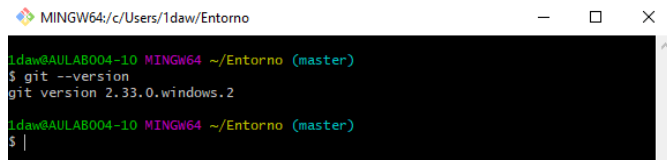

# Entornos de Desarrollo


### UT1.- Elementos de desarrollo de software

1. Desarrollo de sofware (metodologías tradicionales)

    i.Modelo en cascada
    
    ii.Modelos evolutivos

2. Metodologías ágiles

### UT2.-Instalación y uso de entornos de desarrollo

- IntelliJ IDEA 
- Eclipse 
- NetBeans 

### UT3.-Sistemas de coontrol de versiones

````
git --version
````



Todo esto está en el [Aula Virtual](https://aulavirtual33.educa.madrid.org/ies.quevedo.madrid/)